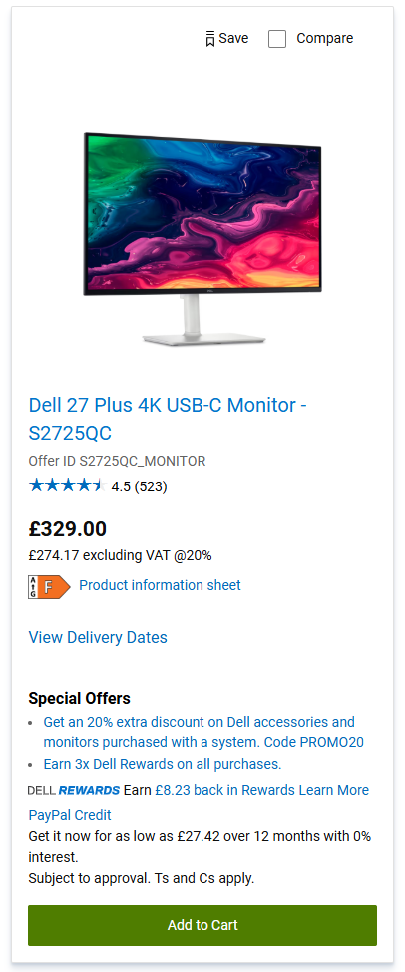

# Input

- This Skill expects user provides an URL of the product page.
- This Skill comes with screenshots as example, please also load the images with "read_local_image" tool as input.

# Instruction

1. Open the product page URL.
2. Find a Model in the page, take  as an example, you can extract the following information (hints:product-url usually comes as a link with the model no):

```json
  {
    "model":"Dell 27 Plus 4K USB-C Monitor - S2725QC",
    "product-url":"https://www.dell.com/en-gb/shop/monitors/apd/dell-27-plus-4k-usb-c-monitor-s2725qc/s2725qc_monitor/-",
    "price":"£329.00"
  }
```
3. With the similar box in page, extract all models available in the page.
4. If next page is available, click-and-go to the next page, waiting for 10 seconds to load the page. Take  as an example, the "Next" link is enabled mean page 2 is available, if the "Next" like is disabled means that is the last page.
5. Extract all models again, until the last page.
6. Return the model list as the result.

# Error handling

- For any error, waiting for 5 seconds and try again.
- If any error when loading the page, retry 3 times. Report the error if it still failed.
- Capture the screenshot of the error page and save it into the 'screenshots' folder with timestamp as part of the filename. 